<!-- SPDX-License-Identifier: LicenseRef-Proprietary
SPDX-FileCopyrightText: Copyright (c) 2025 Maciej Szwaj
See LICENSE file in the root directory for full license terms -->

# SIMux - Table of Content
1. [Introduction](#introduction)
2. [Connection](#connection)
    * [Set simple environment](#items-to-set-simple-environment)
3. [Configuration](#configuration)
    * [MobaXterm](#MobaXterm)
    * [Putty](#Putty)
    * [Minicom](#minicom)
    * [Android Serial USB Terminal](#android-serial-usb-terminal)
4. [Extension boards]()
5. [List of commands](#list-of-commands)
    * [Basic commands](#basic-commands)
    * [System commands](#system-commands)
    * [Examples](#examples-of-usage)
        * [0-4](#0-4)
        * [SIMx=0-4](#simx0-4)
        * [STATE](#state)
        * [INFO](#info)
        * [HELP / ?](#help)
        * [GETSN](#getsn)
        * [SETSN=x](#setsnx)
        * [CLEARSN](#clearsn)
        * [RESET](#reset)
        * [I2C](#i2c)

6. [Button]()
7. [License](#license)

## Introduction
SIMux allows users to switch SIM cards under one target device.\
Currently allows to choose 1 out of 4 nanoSIM cards or switch SIM off.\
It is possible to use on any OS which supports _UART_ or _USB CDC_ connectivity.\
Checked on:
- Windows 11 with Putty and MobaXterm
- Linux Ubuntu 24.04 with minicom
- Android 16 with [Serial USB Terminal](https://play.google.com/store/apps/details?id=de.kai_morich.serial_usb_terminal&hl=pl) app

No need to install any additional drivers.

## Connection
Insert nanoSIM cards to the slots on SIMux.\
Choose FPC which fits to your target device’s nanoSIM slot. Another end of it insert to FPC connector on SIMux.\
Connect SIMux via USB-C to a Windows/Linux PC or Android phone/tablet.\
If there is no host device it is possible to just connect to a power brick (regular 5V phone charger will be enough) and use the button on the SIMux to switch SIM cards.\
SIMux takes only 10mA for regular work.\
For using UART install any dedicated software (or use what’s the best at the moment).

### Set simple environment
_Example 1:_\
Items:
* PC
* USB-C cable
* SIMux board
* FPCB
* a phone with nanoSIM slot

Connect PC with SIMux board by USB-C cable -> it gives power and data exchange\
Connect SIMux board with a phone by FPCB -> it connects SIM card from SIMux board to the phone\
For usage with UART/CDC connection and control

_Example 2:_\
Items:
* phone charger
* USB-C cable
* SIMux board
* FPCB
* a phone with nanoSIM slot

Connect phone charger with SIMux board by USB-C cable -> it gives power to the board\
Connect SIMux board with a phone by FPCB -> it connects SIM card from SIMux board to the phone\
For usage with on-board button

_Example 3:_\
Items:
* USB-C cable
* SIMux board
* FPCB
* a phone with USB OTG and nanoSIM slot

Connect a phone's USB with SIMux board by USB-C cable -> it gives power and data exchange\
Connect SIMux board with the phone by FPCB -> it connects SIM card from SIMux board to the phone\
For usage with UART/CDC connection and control

## Configuration:
```
baud rate: 115200
CR+LF
Data bits: 8
Stop bits: 1
Parity: None
Flow control: None
```
_Provides step-by-step guide on how to connect and operate the device._

### MobaXterm
1. Connect SIMux board to PC
2. Open MobaXterm
3. Set new session\
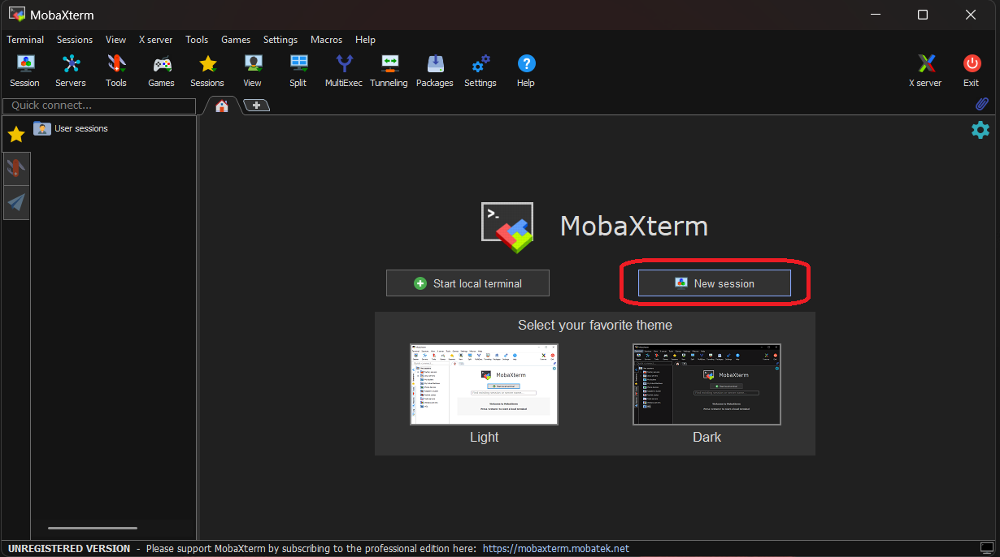
4. Choose Serial
5. Set Speed as 115200
6. Choose correct COM port - _it may differ from this manual_
7. Fill Advanced Serial settings as it is mentioned here in [Configuration](#configuration)\
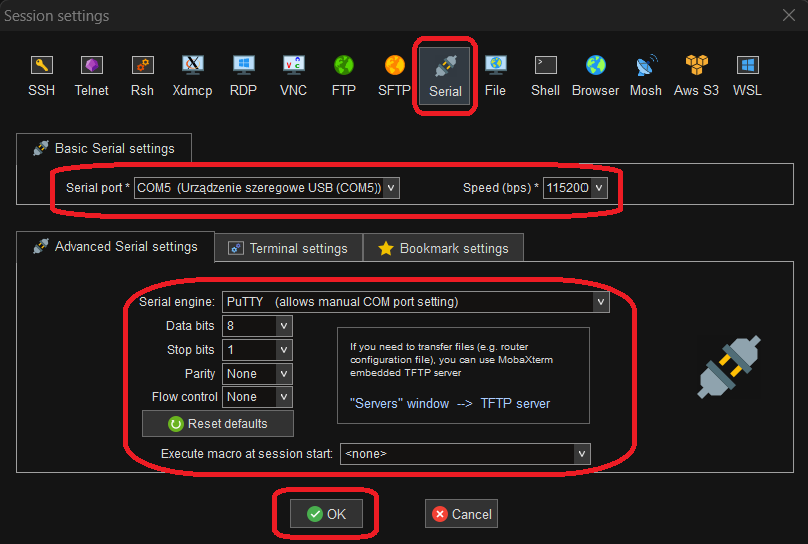
8. Go to Terminal settings
9. Go to Expert settings
10. In Terminal features mark 'Force local echo on' and 'Force local line editing on'\
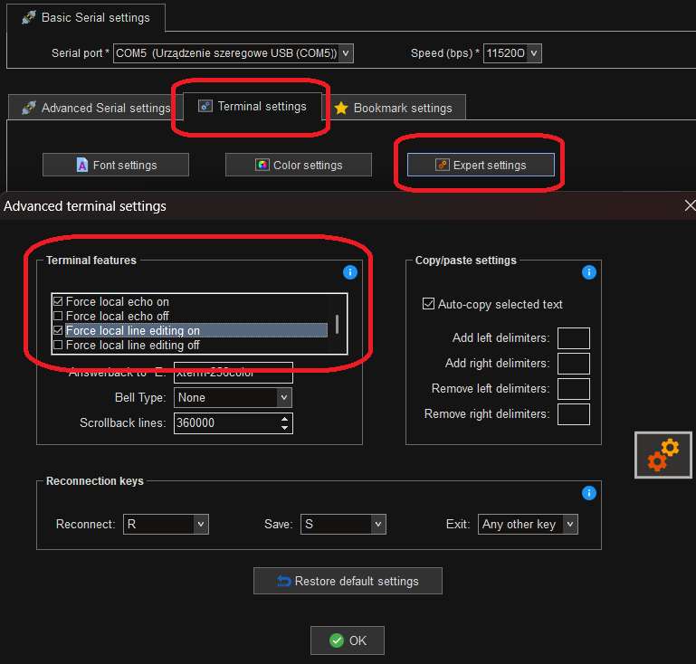

An exported profile is available here: [SIMux MobaXterm connection profile](MobaXterm/SIMux.mxtsessions)\
__All other profiles will be deleted if you import this one__\
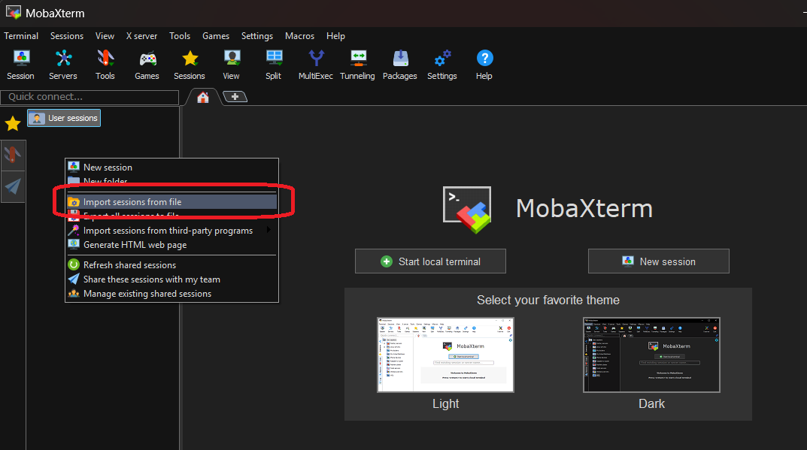

### Putty
1. Connect SIMux board to PC
2. Open Putty
3. Choose Connection type as Serial
4. Type in correct COM port - _it may differ from this manual_
5. Set Speed as 115200\
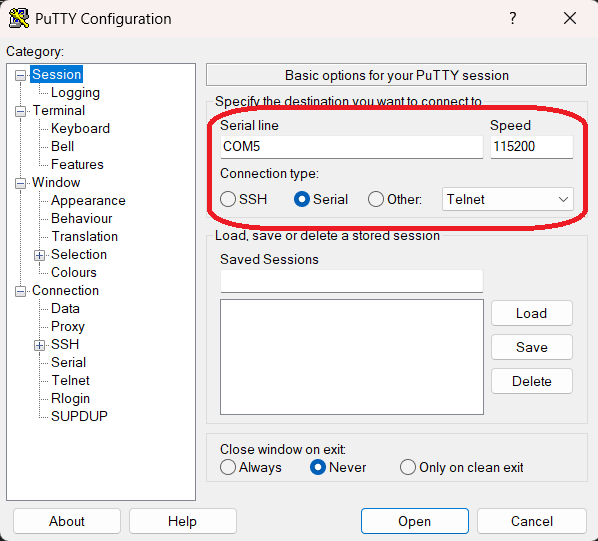
6. Open Serial from category
7. Fill settings as it is mentioned here in [Configuration](#configuration)\
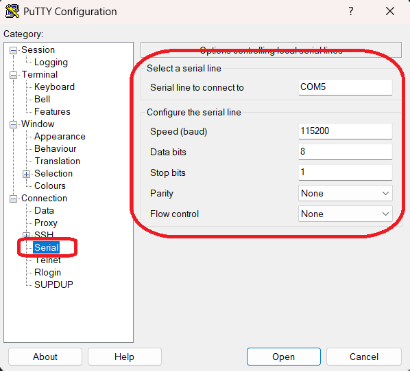
8. Come back to Session in category
9. Type the name and choose Save to not set the connection every time\
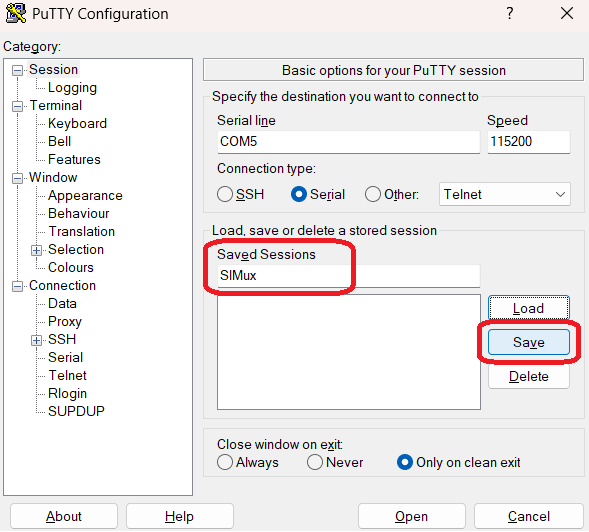

### minicom
1. Connect SIMux board to PC
2. Open Terminal
3. ```sudo minicom -s``` - opens configuration mode of minicom
4. Choose ```Screen```\
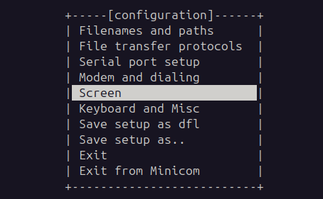
4. Set ```Q - Local echo``` to ```Yes``` - to make input visible
5. Make sure ```T - Add carriage return``` is set to ```No```\
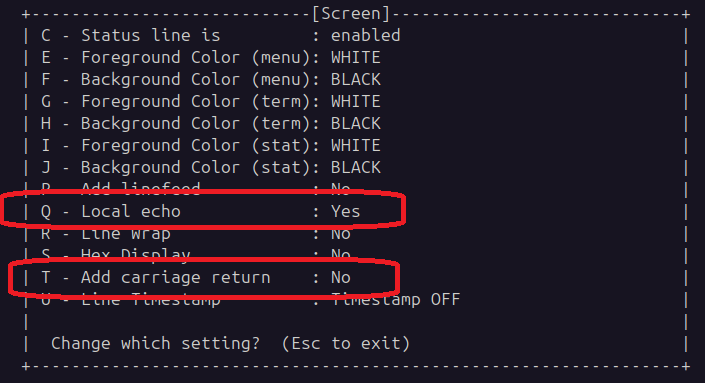
5. ```Save setup as dfl```
6. ```Exit from Minicom```
7. ```minicom -b 115200 -D /dev/ttyACM0``` - _it may differ from this manual_ check with ```ls /dev/ttyACM*```
8. Ctrl+A > Q > Yes to quit

### Android Serial USB Terminal
Link to the app: [Serial USB Terminal](https://play.google.com/store/apps/details?id=de.kai_morich.serial_usb_terminal&hl=pl)
1. Connect SIMux board to smartphone/tablet
2. Open the application
3. Hamburger Menu > USB Devices
4. Choose (probably the only one) device\
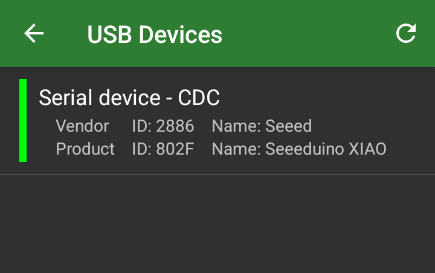
5. Confirm app access to the device
> It is possible to make 6 shortcuts for often used commands

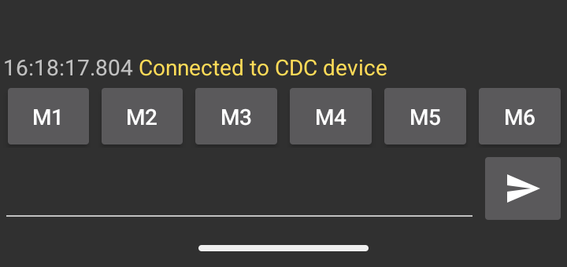

## Extension boards
All boards are the same desing.\
It is possible to connect up to 8 boards together where only one needs MCU.\
Boards need to be connected by Grove cables.\
Each board has 2 exactly the same Grove sockets.\
> __Insert photo here__

## List of commands
### Basic commands
|   Command    |    Description |
|   ---   |    ---   |
|   0-4    |    Choose SIM slot number (1 to 4) for board 0 or disable SIM (0)   |
|   SIMx=0-4    |   Choose SIM slot number (1 to 4) for board x (0-7) or disable SIM (0)    |
|   STATE   |   Show currently chosen SIM card for each connected board  |
<!-- |   SETSIMNAMEx=NAME    |   Assign a NAME to SIM slot __TBD__   |
|   GETSIMNAMES    |   Print out current SIM Slots names __TBD__   | -->

### System commands
|   Command |   Description |
|   --- |   ---   |
|   RESET   |   Reset/reboot the device |
|   GETSN   |   Get serial number of the device |
|   SETSN=x  |   Set your own serial number for easier recognition    |
|   INFO    |   Show device information |
|   HELP / ?    |   Show help message with all commands listed  |
|   I2C    |   Scan I2c for connected boards and print the list    |
<!-- |   CLEARSN |   Delete assigned serial number if any was assigned. The original one will be restored    | -->

### Examples of usage
#### 0-4
_Description:_ type a single digit from 0 to 4 to: disable SIM (0) or choose one of four SIMs (1-4)\
This command is only for one board or for the board with the lowest address (0x20 to 0x27)\
_Example:_\
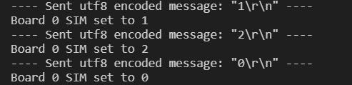

#### SIMx=0-4
_Description:_ type the command and replace x by a digit from 0 to 7 to choose board. After equal sign type single digit from 0 to 4 to: disable SIM (0) or choose one of four SIMs (1-4)\
This command works for the board chosen by the x\
_Example:_\
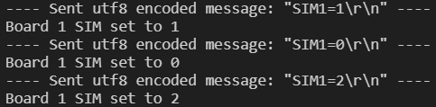
<!--  
#### SETSIMNAMEx="name"
#### GETSIMNAMES
-->
#### STATE
_Description:_ print state for all connected boards with its address, chosen SIM and multiplexers' pins states\
_Example:_\
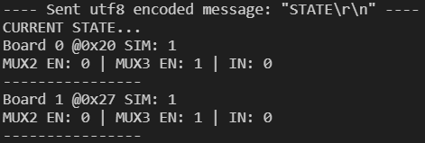
#### INFO
_Description:_ print information about SIMux board: MCU UID, Serial Number, Boot count, Current SIM states for each board\
_Example:_\
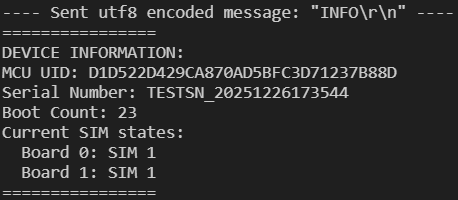
#### HELP / ?
_Description:_ print a list of available commands to use\
_Example:_\
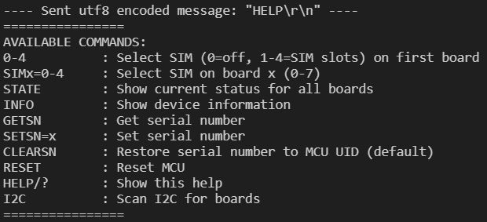
#### GETSN
_Description:_ print serial number\
_Example:_\

#### SETSN=x
_Description:_ set serial number, instead of x type a string without spaces\
_Example:_\
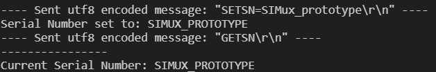
#### CLEARSN
_Description:_ clear serial number, it will be restored to the default one (MCU UID)\
_Example:_\
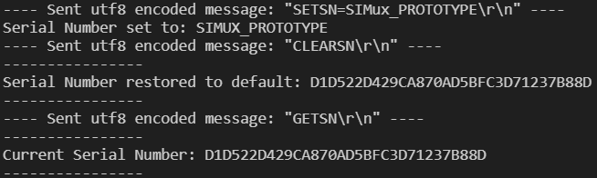
#### RESET
_Description:_ reset SIMux, current SIM settings should remain untouched\
_Example:_\
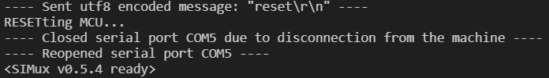
#### I2C
_Description:_ run I2C scan and set boards\
_Example:_\
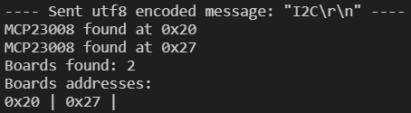

## Button - usage without UART
Button on the board have one simple function: iterate over all SIM slots on the specific board.\
States to iterate:
* No SIM
* SIM1 _(default)_
* SIM2
* SIM3
* SIM4

## License
PROPRIETARY LICENSE - PRIVATE REPOSITORY\
Copyright (c) 2025 Maciej Szwaj (mszwaj). All rights reserved.\
For full licensing information please check [LICENSE](../../LICENSE) file
